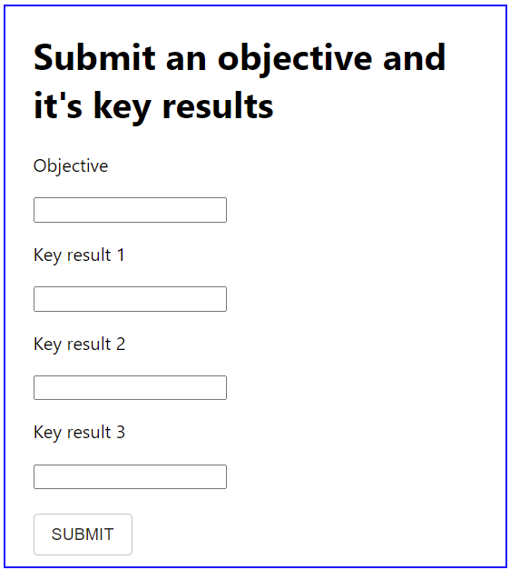
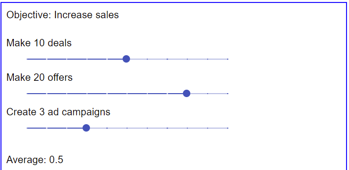

# Objectives and key results - ReactJS prototyyppi

Tämä prototyyppisovellus luotiin osana insinöörityötäni "Perinteisen web-sovelluskehityksen 
ja vähäkoodialustojen vertailu" (https://www.theseus.fi/handle/10024/750445).

Sovellus on ohjelmoitu JavaScriptillä ja se hyödyntää ReactJS-ohjelmakehystä. Tietokantana toimii paikallinen JSON-tiedosto, jonka kansa sovellus keskustelee JSON Server-rajapinnan kautta.

Insinöörityössä tutkittiin ja vertailtiin kahta erilaista tapaa kehittää web-sovelluksia. Vertailun kohteena olivat web-sovelluskehitys käsin ohjelmoimalla ja konfigurointiin perustuvat vähäkoodialustat. Insinöörityöhön valitut kehitystapojen edustajat ovat perinteisen web-sovelluskehittämisen osalta ReactJS ja vähäkoodialustojen osalta AppSheet. Molemmilla ratkaisuilla on mahdollista tehdä toisiaan vastaavia toteutuksia. Insinöörityössä haluttiin selvittää, miten vähäkoodisovellus vertautuu käsin ohjelmoituun sovellukseen. Vertailu tehtiin luomalla prototyyppisovellukset molemmilla kehitystavoilla.

 
